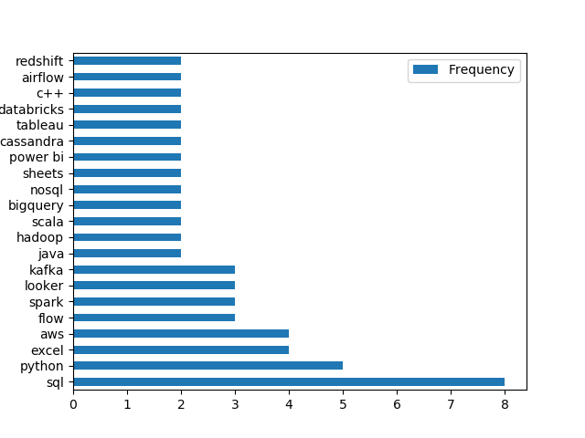

# Introduction
A look into the job market (specifically at data analyst roles). This project explores the following:
- top-paying jobs
- in-demand skills
- where high demand skills meets high salary.

Find the SQL series [here](/project_sql/) and some Python visualisations of the results [here](/project_python/).
# Background
This project was done as a refresher to SQL and delves into the job market for data analyst positions which I am currently on the hunt for by following along with this [SQL course](https://lukebarousse.com/sql), which also supplies the data for the project. The data comprises of various information about job postings, such as the job titles, average salaries, locations, and necessary skills.

### The questions I wanted to answer through this analysis are:
1. What are the top-paying data analyst jobs in my country?
2. What skills are required for these jobs?
3. What skills are most in demand for data analysts?
4. Which skills are associated with higher pay?
5. What are the most optimal skills to learn?

# Tools I Used
For this deep dive into the job market I used several key tools:
- **SQL**: The backbone of the analyses, allowing me to query the database to come to critical insights.
- **PostgreSQL**: The chosen database management system, ideal for handling the given job data.
- **Python**: Giving acces to libraries such as Pandas and matplotlib for quick analysis and visualisation of the results from our SQL queries.
- **Visual Studio Code**: A go-to for database management and executing the code.
- **Git and GitHub**: Essential for version control and sharing the analysis. 
# The Analysis

### 1. Top Paying Data Analyst Jobs
To identify the highest-paying roles I filtered data analyst positions by my location (using the country) and yearly average salary. This query highlights the high paying opportunities in the field.

```sql
SELECT 
    job_id,
    job_title,
    job_location,
    job_schedule_type,
    salary_year_avg * 18.65 AS salary_year_avg_rands, --conversion to rands from usd at time of project
    job_posted_date,
    name AS company_name
FROM
    job_postings_fact
LEFT JOIN company_dim ON job_postings_fact.company_id = company_dim.company_id
WHERE
    job_title_short = 'Data Analyst' AND
    job_country LIKE '%South Africa%' AND
    salary_year_avg IS NOT NULL
ORDER BY 
    salary_year_avg DESC
LIMIT 10
```
Here is the breakdown of the top data analyst jobs in 2023 in South Africa:
- **Salary Range**: The salaries in this top 10 bracket range from R1.8M - 3M. Indicating significant salary potential, although when comparing it to the overall top 10 or the fully remote top 10 it falls significantly short.
- **Employers**: A number of the highest-paying positions were taken by takealot.com and Standard Bank. (I will be keeping an eye on these postings in future)
- **Location**: While joburg has the highest paying job, there are still plenty of high-paying opportunites in Cape Town.

### 2. Skills for Top Paying Jobs
To gain insights on which skills the top-paying jobs are asking for, I joined the job postings with the skills data.
```sql
WITH top_paying_jobs AS (

    SELECT 
        job_id,
        job_title,
        job_location,
        salary_year_avg,
        name AS company_name
    FROM
        job_postings_fact
    LEFT JOIN company_dim ON job_postings_fact.company_id = company_dim.company_id
    WHERE
        job_title_short = 'Data Analyst' AND
        job_country LIKE '%South Africa%' AND
        salary_year_avg IS NOT NULL
    ORDER BY 
        salary_year_avg DESC
    LIMIT 10

)

SELECT 
    top_paying_jobs.*,
    skills 
FROM 
    top_paying_jobs
INNER JOIN skills_job_dim ON top_paying_jobs.job_id = skills_job_dim.job_id
INNER JOIN skills_dim ON skills_dim.skill_id = skills_job_dim.skill_id
ORDER BY
    salary_year_avg DESC
```

The following graph was then generated in Python using Pandas for skills which were requested more than once in these 10 jobs and it can be observed that 8 of the top 10 jobs requested SQL as a skill, with python, excel and aws following behind.



### 3. In-Demand Skills for Data Analysts
This query focused on finding the most in demand skills across all the data for the data analyst position.
```sql
SELECT 
    skills,
    COUNT(skills_job_dim.job_id) AS demand_count
FROM 
    job_postings_fact
INNER JOIN skills_job_dim ON job_postings_fact.job_id = skills_job_dim.job_id
INNER JOIN skills_dim ON skills_dim.skill_id = skills_job_dim.skill_id
WHERE
    job_title_short = 'Data Analyst'
GROUP BY
    skills
ORDER BY
    demand_count DESC
LIMIT 5
```
Using the following code in Pythonm is was established how large of a percentage each skill was in the top 5.
```python
df["percentage_skill_requested"] = df['demand_count']*100/df['demand_count'].sum()
```

The top 5 most in deman skills for data analysts in 2023 were:
- **SQL** (30.5%) and **Excel** (22.12%) made up the two largest skills, emphasising the need for strong fundamentals in data processing and spreadsheet manipulation.
- **Programming and Visualisation tools** like **Python**, **Tableau**, and **Power Bi** are also essential, indicating the increasing importance of technical skills in data storytelling and decision support.


Which can be seen as a percentage as follows:


### 4. Skills Based on Salary
A query to help find which skills had the highest average salaries associated with them.
```sql
SELECT 
    skills,
    ROUND(AVG(salary_year_avg), 2) AS avg_salary
FROM 
    job_postings_fact
INNER JOIN skills_job_dim ON job_postings_fact.job_id = skills_job_dim.job_id
INNER JOIN skills_dim ON skills_dim.skill_id = skills_job_dim.skill_id
WHERE
    job_title_short = 'Data Analyst'
    AND salary_year_avg IS NOT NULL
GROUP BY
    skills
ORDER BY
    avg_salary DESC
```

I was then able to do quick look-ups with Python, for example:

```python 
print(df.head())

print(df[df["skills"] == "python"])
print(df[df["skills"] == "sql"])
print("Top skill: \n {}  ".format(df.iloc[0]))
```
The following table shows the skills with the highest average salary associated with them:

|   Skills   |  Avg Salary  |
|------------|--------------|
|    svn     |   400000.0   |
|  solidity  |   179000.0   |
|  couchbase |   160515.0   |
|  datarobot |   155485.5   |
|   golang   |   155000.0   |

- There is a lot of money to be found in **Big Data** (eg. Couchbase) and **ML tools** (eg. DataRoot).
- Knowledge of skills in **software development and deployment** were also found high on the list showing a crossover between data analysis and engineering skills.


### 5. Most Optimal Skills 
Insight on what the most optimal skills for a budding data analyst to be proficient in based on our previous two queries, i.e. demand and pay-per-skill.

```sql
SELECT
    skills_dim.skill_id,
    skills_dim.skills,
    COUNT(skills_job_dim.job_id) AS demand_count,
    ROUND(AVG(salary_year_avg), 2) AS avg_salary
FROM 
    job_postings_fact
INNER JOIN skills_job_dim ON job_postings_fact.job_id = skills_job_dim.job_id
INNER JOIN skills_dim ON skills_dim.skill_id = skills_job_dim.skill_id
WHERE
    job_title_short = 'Data Analyst'
    AND salary_year_avg IS NOT NULL
    AND (job_work_from_home = True OR job_location LIKE 'Cape Town%')
GROUP BY
    skills_dim.skill_id
HAVING  
    COUNT(skills_job_dim.job_id) > 10
ORDER BY
    avg_salary DESC,
    demand_count DESC
LIMIT 25;
```
From this query we found:
- **High-demand programming languages**: SQL, Python, R stand out with their high demand in the job market for data analytics in Cape Town/ and remote jobs with very similar associated average salaries.
- **Cloud tools**: Skills such as AWS and Snowflake were associated with some of the highest salaries whilst still being in high demand in the specified region. Definitely a bonus to pick these up!

# What I Learned
- **Building a database**: Got some hands on experience adding data to the database and manipulating tables.
- **Complex Query Crafting**: I have become more comfortable with joins and CTEs.
- **Data Aggregation**: Practiced many examples using aggregation functions and the HAVING clause.
- **Analytical Skills**: Got hands on experience analysing the data to turn the given questions into actionable insights.

# Conclusions

### Insights
1. **Top-Paying Data Analyst Jobs**:
The highest paying jobs in data analytics offer a wide range of salaries. In my country the highest going up to 3M a year!
2. **Skills for Top-Paying Jobs**:
High paying jobs require proficiency in SQL. It is critical I master SQL to gety a high-paying data analytics role.
3. **Most In-Demand Skills**:
SQL is also one of the most in demand skills in the data analytics field. Essential to anyone looking for a job as a data analyst.
4. **Skills with Higher Salaries**:
Specialised skills such as SVN (version control system) and solidity (statistically-typed programming language) are associated with the highest salaries. Indicating that they are niche skills.
5. **Optimal Skills for Job Market Value**:
SQL leads in demand and also has a good associated average salary, whilst the specialised skills above are not frequently in demand. SQL remains the optimal skill to learn for aspiring data analysts to maximise their market potential.

### Closing remarks
This project really helped to build my confidence in SQL. The results that followed the analysis then ensured me that this could only help with my job search in data analytics as it is the most optimal skill to learn! I was able to see how to use the data and turn it into something more useful along the way in this engaging tutorial.